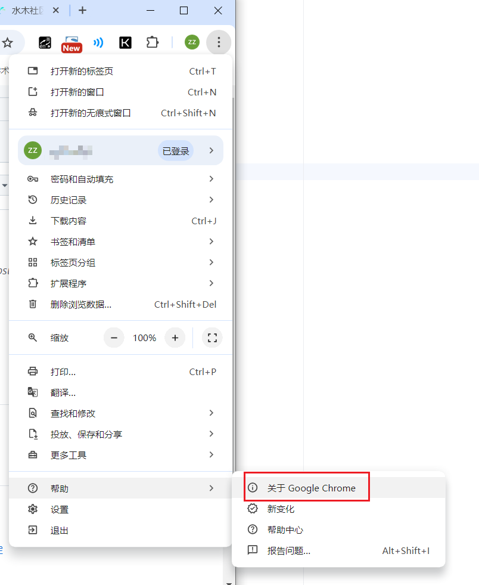
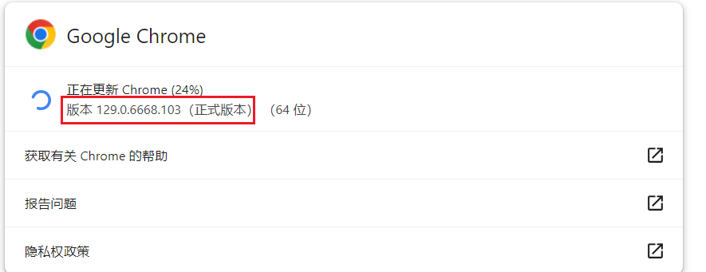
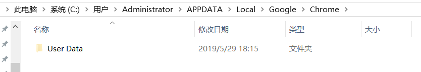
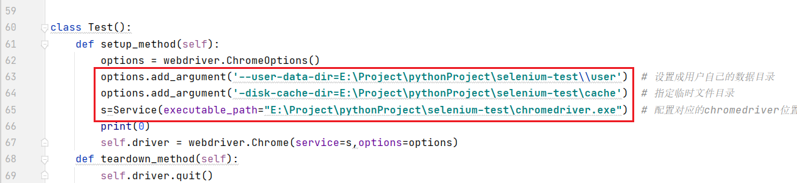

# 基于selenium自动获取Bing积分脚本

## 环境

python3 

selenium

chrome

## 运行前准备

1. 安装selenium python依赖

```
pip install selenium
```

2. 之后看自己chorme的版本

   

   

3. 从此地址https://googlechromelabs.github.io/chrome-for-testing/，下载chromedriver。

4. 然后打开自己的使用的chrome，登录bing，之后将用户的信息复制到某个目录下。（该操作可以让selenium打开的chrome页面保持用户登录）

   本机chrome信息地址，C:\Users\Administrator\APPDATA\Local\Google\Chrome

   Administrator替换成你自己的用户名

   

5. 运行前配置参数，配置下图三个信息，

63行配置为步骤4中复制的用户信息所在路径

64行缓存，随便找一个地址即可

65行配置步骤3中下载的chromedriver信息。



## 执行

运行 autoRewardTest.py 即可。

第一次配置好上述内容之后，后续每次执行autoRewardTest.py即可。

